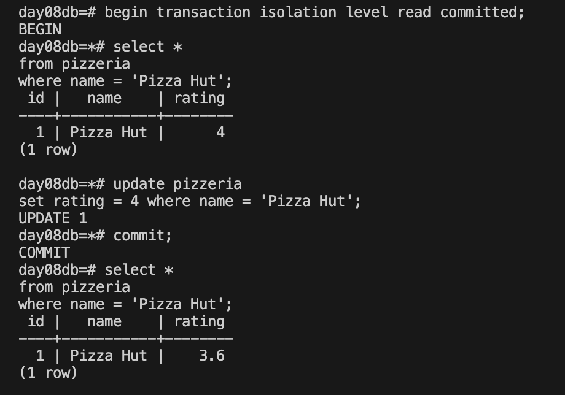
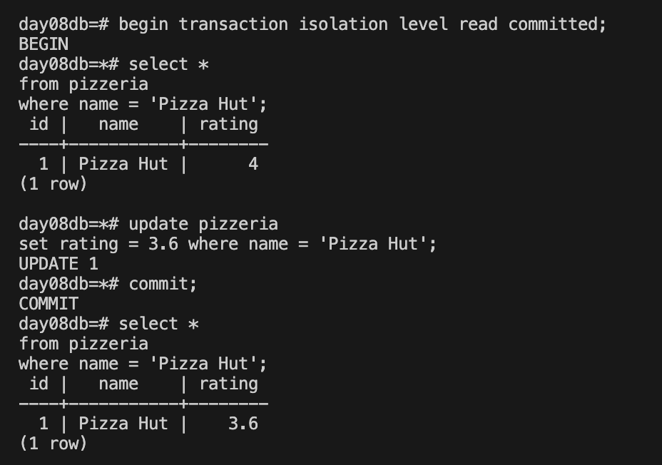
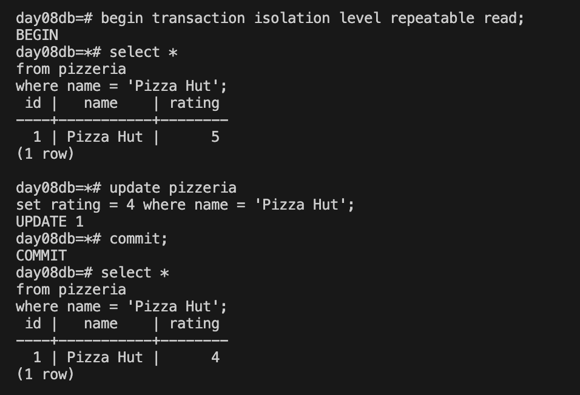
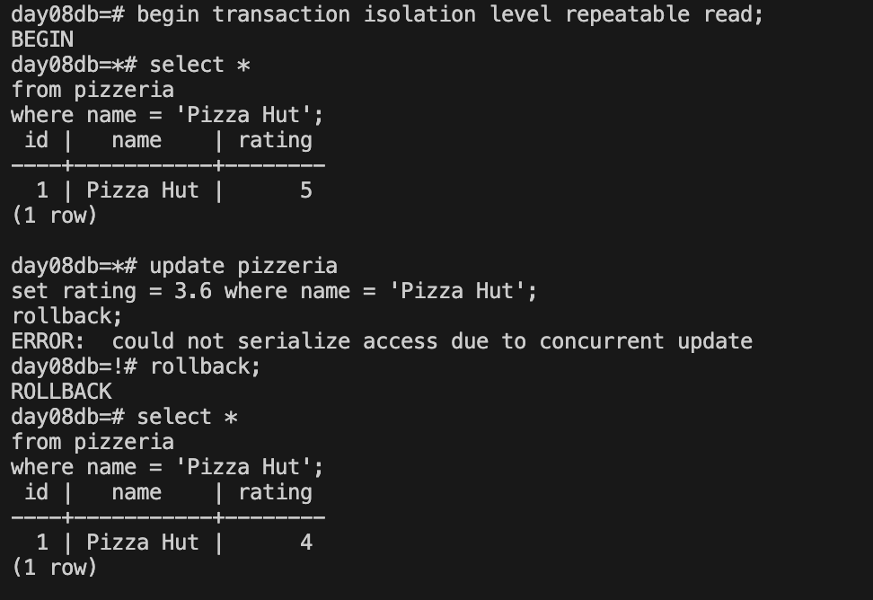

# Concurrent Access — Транзакции и потеря обновлений

## Бизнес-задача

Два менеджера одновременно редактируют рейтинг ресторана. В стандартном режиме (`READ COMMITTED`) второе обновление затирает первое — **Lost Update**.

Нужно показать проблему и ее решение через `REPEATABLE READ`.

## Файлы

| Файл | Что демонстрирует |
|------|------------------|
| `01_session1_lost_update.sql` | Session #1 читает и обновляет рейтинг |
| `02_session2_lost_update.sql` | Session #2 обновляет рейтинг, затирая изменения Session #1 |
| `03_session1_repeatable_read_fix.sql` | Session #1 с уровнем `REPEATABLE READ` |
| `04_session2_repeatable_read_fix.sql` | Session #2 пытается обновить — получает ошибку конфликта |

## Как запустить

1. Откройте два терминала (psql)
2. Запустите Session #1 в первом, Session #2 во втором
3. Следуйте порядку операций:
### Session 1
BEGIN
SELECT
### Session 2
BEGIN
SELECT
UPDATE
COMMIT
### Session 1
UPDATE
### Для 1 случая:
COMMIT
SELECT
### Для 2 случая:
ROLLBACK

## Результат

Демонстрация, как уровень изоляции `REPEATABLE READ` защищает от потери обновлений.

## Скриншоты запуска

### 01_session1

### 02_session2

### 03_session1

### 04_session2

